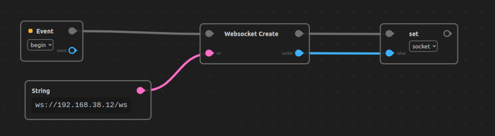
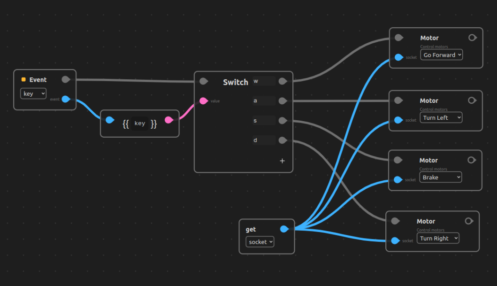

# mbot-esp32

This repository contains:

* An esp32 webserver firmware. 
 Provides an API of commands called through websockets, allowing a web client to control the device.

* An [Oxenode](https://oxenode.io/) plugin (`./oxenode/mbot-esp32`). Provides bindings for sending instructions through websockets. Acts as a web client to the esp32 firmware.

<br/>

## Robot & Hardware

This firmware is meant to be used with an `esp32` devkit, wired to a `l298` motor controller.


## Oxenode Client Script

### Websocket creation



### Keyboard event (WASD controls)



<br/>

## ESP32 Build Firmware

We are using the official esp-idf sdk, once installed, you can run the alias to get everything setup.

```
get_idf
```

You can then use make to build and upload to the esp32

```
make build
```

```
make upload
```

## Oxenode Plugin CDN

```
cdn
```
