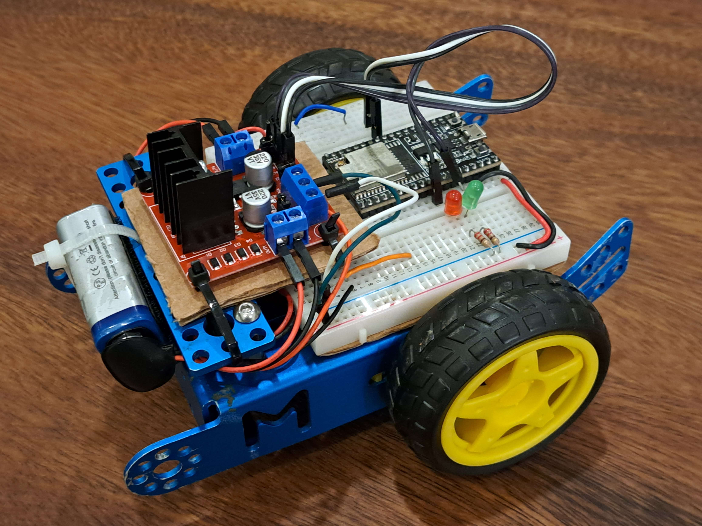

# mbot-esp32

This software is a ESP32 Websocket Instruction Interpreter.

It listens for incoming Websockets, and performs actions based on the recieved instructions.

An [Oxenode](https://oxenode.io/) plugin is available in `./oxenode/esp32-car` as a CDN resource. The plugin gives bindings for sending instructions through websockets. 

## Robot & Hardware



This software is meant to be used with an `esp32` devkit, wired to a `l298` motor controller.


## Build

We are using the official esp-idf sdk, once installed, you can run the alias to get everything setup.

```
get_idf
```

You can then use make to build and upload to the esp32

```
make build
```

```
make upload
```

## Oxenode Plugin CDN

```
cdn
```
